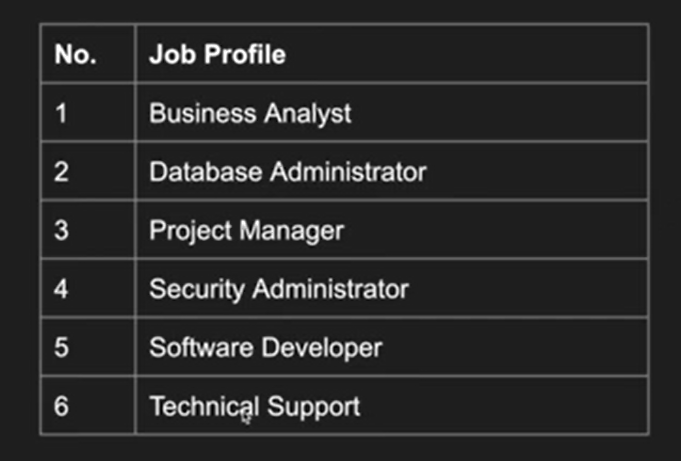
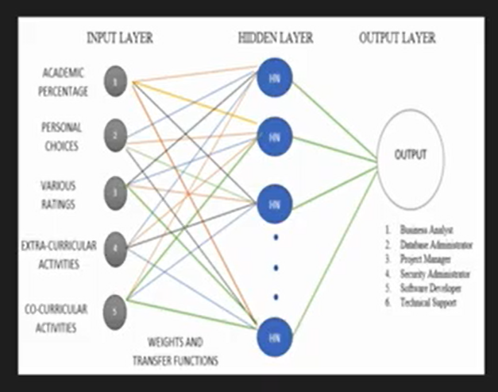
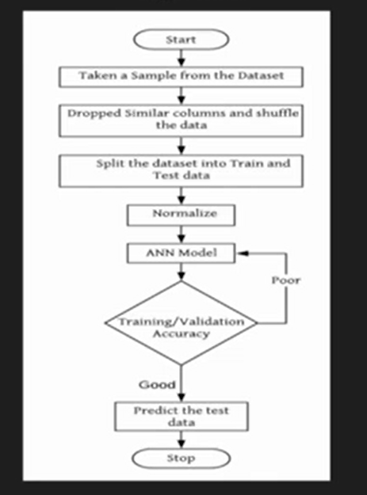
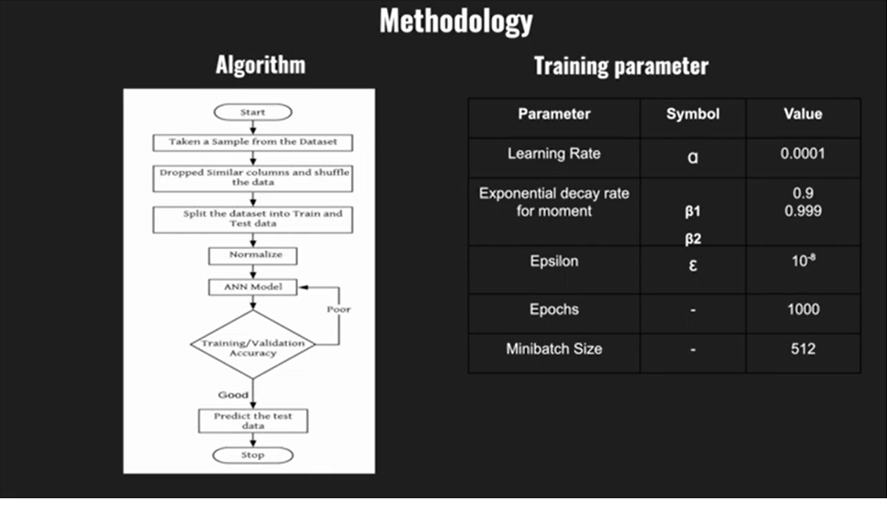
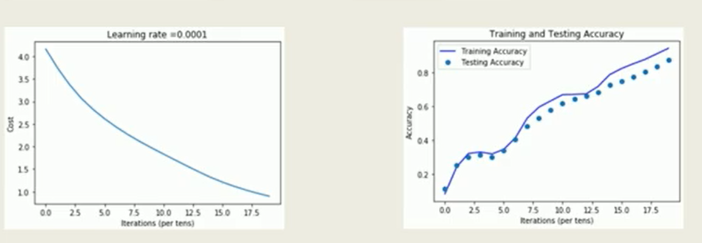

#  help(career)

>   help(career) is a tool to help computer science students choose their best future career path after their undergraduate programme or to help them choose the right course for the poe-graduate studies built with ML on **Neural Network**

### Capstone Project at SPE/CYPHERCRESCENT 2022 Internship

>   Building with love by Rasheed!

##  Break Down of what I wish to achieve!

#  Expected Inputs
>   15 inputs data are extracted from the data
    

#  Expected Outputs
>   6 Outputs result are expected
    

#  Architecture
>   The Neural Network Arch.follow this 
    

#  Algorithm flow
>   Proposed algorithm flow chart.
    

#  Training Parameters
>   Training params
    

#  Expected Results
>   Results result are expected
    